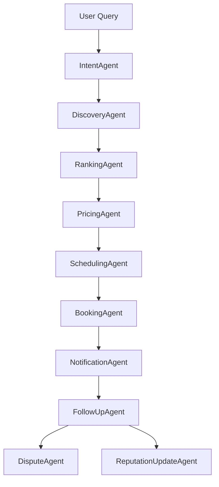

# 10-Agent Pipeline Blueprint

### Agents Details:
1. **IntentAgent**: Parses raw queries for category, location, urgency, and budget constraints.
2. **DiscoveryAgent**: Searches synthetic database for matching providers.
3. **RankingAgent**: Ranks using 10 weighted metrics.
4. **PricingAgent**: Computes dynamic price.
5. **SchedulingAgent**: Locks time slots and applies emergency constraints.
6. **BookingAgent**: Commits and validates bookings.
7. **NotificationAgent**: Triggers simulated communication alerts.
8. **FollowUpAgent**: Runs lifecycle states.
9. **DisputeAgent**: Handles disputes through AI mediation.
10. **ReputationUpdateAgent**: Recalculates metrics post-booking.
